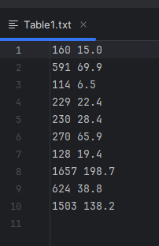
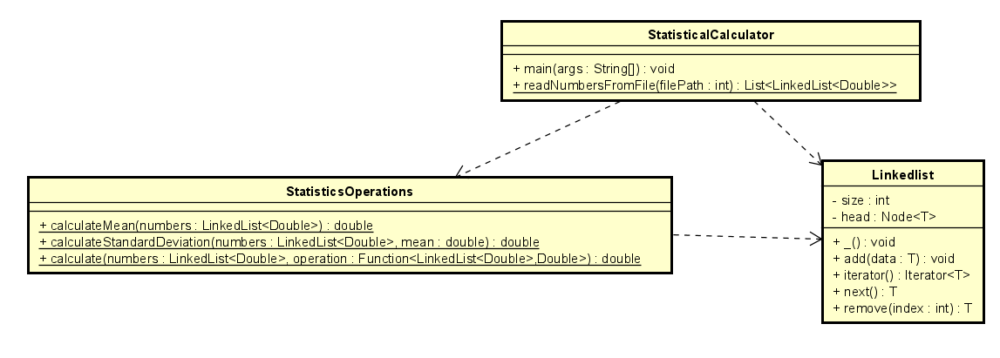

# TareaDiseñoOOGenerics

It is a program that allows calculating the mean and the standard deviation of a set of n real numbers. This program reads txt files that have a column and row structure like the document "**Table1.txt**".



For example, a typical invocation would be:
```
java -jar target/TareaDisenoOOGenerics-1.0-SNAPSHOT.jar "FilePath"
```

In the following path you will have four files "*BadFile.txt*", "*Empty.txt*", "*Example2ThreeColumns.txt*" and "*Table1.txt*", with which you can test the project.

```
src/main/java/edu/escuelaing/arsw/ASE/app/
```
### LOC/h Calculation

To calculate LOC, 148 lines of code are taken into account, in 6 hours. So your productivity for this project is **24,6 LOC/h**.


## Starting

In order to use the project on your system, you can access the following link and download a compressed file of it.

You can also clone the file using the following command.

```
git clone https://github.com/Richi025/TareaDisenoOOGenerics.git
```
if you want to run the application use the command.

```
java -jar target/TareaDisenoOOGenerics-1.0-SNAPSHOT.jar "src/main/java/edu/escuelaing/arsw/ASE/app/Tabla1.txt"
```


### Previous requirements

It is necessary to have "**Maven**" and "**Java**" installed, preferably in their latest versions.

### * Maven
```
Download Maven at http://maven.apache.org/download.html 

Follow the instructions at http://maven.apache.org/download.html#Installation
```
### * Java

```
Download Java at https://www.java.com/es/download/ie_manual.jsp
```


### Installing

Once you have the cloned project in your repository. Follow the steps below to launch the program successfully

1. Open a terminal and enter the folder where I clone the repository.

2. Use the following command to compile and clean the target directory.
```
mvn clean compile
```
3. Now use the following command to package the project as a JAR file.

```
mvn package
```

4.Now you can run the project using the following command.

```
You can use the following files.

1. src/main/java/edu/escuelaing/arsw/ASE/app/Tabla1.txt 
2. src/main/java/edu/escuelaing/arsw/ASE/app/Empty.txt
3. src/main/java/edu/escuelaing/arsw/ASE/app/BadFiles.txt
4. src/main/java/edu/escuelaing/arsw/ASE/app/Example2ThreeColumns.txt

java -jar target/TareaDisenoOOGenerics-1.0-SNAPSHOT.jar "src/main/java/edu/escuelaing/arsw/ASE/app/Tabla1.txt"
```


## Running the tests

To run the tests you can use the following Maven command

```
mvn test
```


### Example tests

Seven unit tests were conducted, which verify the proper functioning of the code's methods and validate them against the responses obtained through the console.
```
    @Test
    public void testCalculateMeanFileTable1() {
        String filePath = "src/main/java/edu/escuelaing/arsw/ASE/app/Table1.txt";
        try{
            List<LinkedList<Double>> columns = StatisticalCalculator.readNumbersFromFile(filePath);
            double meanColumn1 = StatisticsOperations.calculateMean(columns.get(0));
            assertEquals(550.6, meanColumn1, 0.001);
            double meanColumn2 = StatisticsOperations.calculateMean(columns.get(1));
            assertEquals(60.32, meanColumn2, 0.001);
        }catch(Exception e){
            fail("Exception occurred" + e.getMessage());
        }
    }
```
## Design

For the design, the following class diagram was made. In which it was considered to have a class for all the methods that are going to perform operations, the LinkedList class and the main class that uses these methods.
The methods considered are the following:

### StadisticsCalculator

* main: It is the main entry point of a program. It is the function or method where the execution of the program begins.

* readNumbersFromFile: Returns a list of LinkedLists, each representing a column of numbers.

### StadisticsOperations

* calculateMean : Calculates the mean (average) of a list of numbers.

* calculateStandardDeviation : Calculates the standard deviation of a list of numbers given the mean.

* calculate : Performs a statistical calculation on a list of numbers using a lambda function.


### LinkedList

* add : Adds a new element to the end of the linked list.
* iterator : Returns an iterator over elements of type T, allows traversing the linkedList
* next : Returns the next element in the iteration.
* remove :Removes the element at the specified index in the linked list.



### Phase architecture

To be able to run the application using "*java -jar*" including in the "pom.xml" file and specifying the main class.

```
    <plugins>
      <plugin>
        <groupId>org.apache.maven.plugins</groupId>
        <artifactId>maven-jar-plugin</artifactId>
        <version>3.1.0</version>
        <configuration>
          <archive>
            <manifest>
              <addClasspath>true</addClasspath>
              <mainClass>edu.escuelaing.arsw.ASE.app.StatisticalCalculator</mainClass>
            </manifest>
          </archive>
        </configuration>
      </plugin>
    </plugins>
```
## Built with

* [Maven](https://maven.apache.org/) - Dependency management
* [java](https://www.java.com/es/) - Programming language

## Versioned

We use [Git](https://github.com/) for version control. For available versions, see the tags in this repository.

## Authors

* **Jose Ricardo Vasquez Vega** - [Richi025](https://github.com/Richi025)

## Date

Wednesday, June 14, 2024

## License

This project is licensed under the GNU license; See the [LICENSE.txt](LICENSE.txt) file for details.